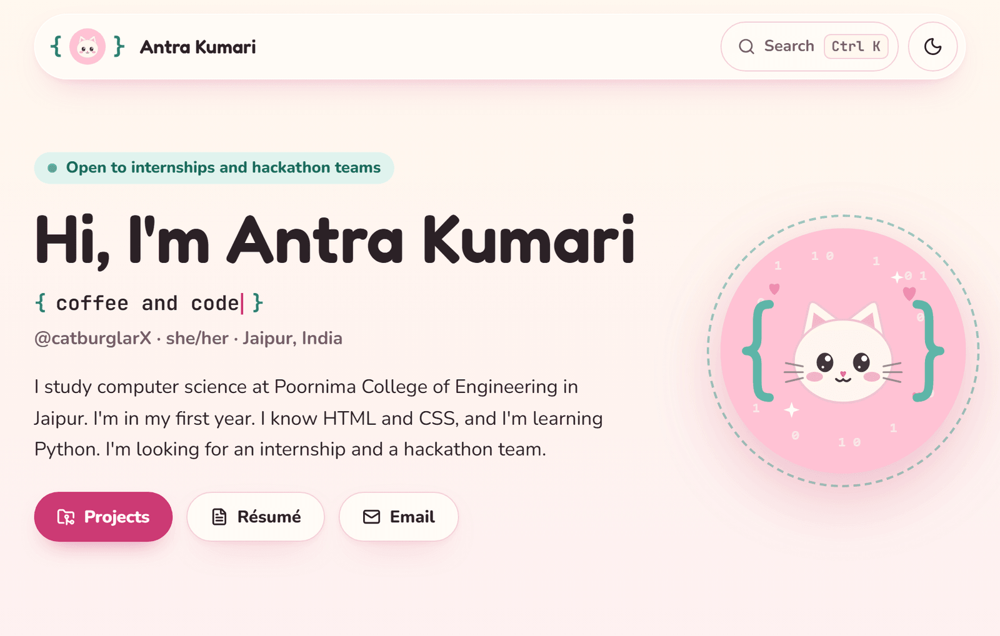
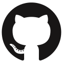

<div align="center">


# Antra Kumari

**coffee and { code }**

First-year B.Tech CSE student at Poornima College of Engineering, Jaipur.<br />
I know HTML and CSS, I'm learning Python, and I'm looking for an internship and a hackathon team.

[Portfolio](https://catburglarx.github.io/catburglarx/) ·
[Email](mailto:connect.antrakumari@gmail.com) ·
[LinkedIn](https://www.linkedin.com/in/catburglarX) ·
[Instagram](https://www.instagram.com/catburglarX) ·
[X](https://x.com/catburglarX)

<br />

<a href="https://catburglarx.github.io/catburglarx/">
  <picture>
    <source media="(prefers-color-scheme: dark)" srcset="docs/screenshot-dark.png" />
    
  </picture>
</a>

<br />

### What I'm working on

**[Maanak](https://github.com/catburglarX/maanak)** helps officers check packaged goods in India.<br />
It reads the label from a photo, keeps the photo next to every reading,<br />
and never guesses when something is missing. Built with FastAPI, PostgreSQL and OCR.

[Read how I built it](https://catburglarx.github.io/catburglarx/projects/maanak/)

### What I use

&nbsp;&nbsp;
&nbsp;&nbsp;
&nbsp;&nbsp;
&nbsp;&nbsp;


HTML, CSS, Git and GitHub. Learning Python right now.

### Hackathons

I took part in Smart India Hackathon 2026. If your team needs someone for the next one, [email me](mailto:connect.antrakumari@gmail.com).

</div>

<br />

<details>
<summary><strong>About this repository: how the portfolio is built</strong></summary>

<br />

This repository is my GitHub profile and the source of my portfolio. The site is a static
Next.js export served by GitHub Pages at
[catburglarx.github.io/catburglarx](https://catburglarx.github.io/catburglarx/).

### Stack

Next.js 16 (App Router, static export), React 19 and strict TypeScript. Tailwind CSS 4 with
design tokens as CSS variables. cmdk and Radix Dialog for the command menu, Sonner for toasts,
Motion for the command menu animation. MDX case studies with Zod-checked frontmatter, and Shiki
for code highlighting at build time. Fredoka, Nunito and JetBrains Mono through `next/font`,
so the fonts are self-hosted. Playwright and axe for tests, GitHub Actions for CI and deploys.

### Run it

You need Node 22 or newer and pnpm 10.

```bash
pnpm install
pnpm dev          # http://localhost:3000/catburglarx/
pnpm verify       # everything CI runs, in order
```

`pnpm build` writes the site to `out/`. `pnpm start` serves that folder the way GitHub Pages
does, and `pnpm test` runs the Playwright suite against it. Copy `.env.example` to `.env.local`
and add a GitHub token if you want the real contribution calendar locally. Without one, the
section shows its fallback.

### Editing the content

Nothing about me lives in a component, so content changes never touch the UI code.

| To change                                                              | Edit                                                                                             |
| ---------------------------------------------------------------------- | ------------------------------------------------------------------------------------------------ |
| Name, bio, status, typed lines, skills, education, hackathons, socials | `src/data/profile.ts`                                                                            |
| A project card and its case study                                      | `content/projects/<slug>.mdx`                                                                    |
| An image or logo                                                       | put the original in `assets/source/`, list it in `scripts/process-assets.mjs`, run `pnpm assets` |

`profile.ts` is checked against the Zod schema in `src/data/schema.ts` on every build, and each
MDX file's frontmatter is checked in `src/lib/projects.ts`. A missing field or a typo fails the
build with the field name, instead of shipping a broken page.

A new project is one file. Copy `content/projects/maanak.mdx`, change the frontmatter, and write
the case study. The frontmatter fields are `title`, `slug` (must match the file name),
`summary`, `date`, `tags`, `stack`, `links` (`code`, `live`), `cover` (an image key), `coverAlt`,
`featured` and `status`. Inside the body, `<Screenshot image="key" alt="..." caption="..." />`
adds a screenshot.

### Folder structure

```text
content/projects/       MDX case studies, one file per project
src/data/               profile.ts (my content), schema.ts and validate.ts (Zod)
src/app/                routes: home, /projects, /projects/[slug], /resume, 404,
                        plus og.png, sitemap, robots, manifest and icons
src/components/home/    one file per home page section
src/components/layout/  top bar, dock, footer, background, theme toggle
src/components/features/  lazy extras: command menu, cursor cat, hearts, toasts
src/components/mascot/  the cat, drawn once as SVG and reused everywhere
src/components/projects/  project card, tag filter, MDX renderer, screenshot
src/components/ui/      small shared pieces: headings with braces, buttons, logos
src/lib/                site paths, GitHub fetch, MDX loader, Shiki theme, stores
scripts/                asset processing, CSP, contrast, bundle budget, résumé PDF
tests/                  Playwright smoke and accessibility tests
```

### What is checked on every push

`.github/workflows/ci.yml` runs all of these, and `deploy.yml` only publishes a commit after
CI has passed for it.

- `tsc` in strict mode, ESLint with no warnings allowed, and Prettier.
- `scripts/check-contrast.mjs` reads the colour tokens from `globals.css` and measures every
  text and background pair in both themes against WCAG 2.2 AA.
- `scripts/check-bundle.mjs` fails if any page loads more than 150 KB of gzipped JavaScript
  before interaction. The home page is about 148 KB, and about 124 KB of that is Next.js and
  React themselves.
- Playwright: every page renders with no console errors, the command menu works from the
  keyboard and gives focus back, the theme toggle works and remembers, axe finds no WCAG
  2.2 AA violations on any page in either theme, and nothing scrolls sideways from 320 to
  1440 pixels wide.
- `scripts/resume-pdf.mjs` prints `/resume` to PDF and fails if it takes more than one A4 page.

The deploy also rebuilds every morning, so the contribution calendar stays current.

### Decisions worth knowing

- **Static export on GitHub Pages.** No server means no contact form, so contact is a mailto
  link and a copy button. It also means no response headers, so `scripts/csp.mjs` writes a
  Content-Security-Policy `<meta>` into every page, with a hash for each inline script instead
  of `'unsafe-inline'`. Styles still need `'unsafe-inline'` because React and `next/image`
  write style attributes. A `<meta>` policy can't set `frame-ancestors`, and Pages can't send
  HSTS or other headers.
- **Images.** Pages has no image optimiser, so `scripts/process-assets.mjs` writes WebP files
  at fixed widths plus a tiny blur placeholder, and `src/lib/image-loader.ts` points
  `next/image` at them.
- **Motion only where it's lazy.** The scroll reveals and the dock magnification are plain CSS
  and a few lines of JavaScript. Using Motion for them added about 50 KB to the first load and
  broke the budget, so Motion only runs inside the command menu, which loads on first use.
- **Prefetch files.** Next 16 writes route prefetch files as nested folders but requests them
  by a flat name. Without rewrites on Pages every prefetch would 404, so
  `scripts/flatten-segments.mjs` copies each one to the name the router asks for.
- **The theme** follows the system until you pick one, and an inline script sets it before the
  first paint so the page never flashes the wrong colours.

### Credits

These projects gave me ideas. No code was copied from them.

- [dillionverma/portfolio](https://github.com/dillionverma/portfolio) (MIT): the single column,
  the blur-fade reveal, the bottom dock and keeping content in one typed file.
- [medy17/Candy-Glass-React-Portfolio](https://github.com/medy17/Candy-Glass-React-Portfolio):
  pink frosted glass and a command menu.
- [adryd325/oneko.js](https://github.com/adryd325/oneko.js) (MIT): a cat that follows the cursor.
  Mine is a new SVG of my own cat, not the oneko sprite.
- [shadcn/ui](https://ui.shadcn.com) (MIT) and [Magic UI](https://magicui.design) (MIT): the
  shape of the command dialog and the dock.

Reused assets:

- Technology logos from [Devicon](https://github.com/devicons/devicon) (MIT). The logos
  themselves are trademarks of their owners.
- GitHub and X marks from [Simple Icons](https://simpleicons.org) (CC0), and interface icons
  from [Lucide](https://lucide.dev) (ISC).
- Fredoka, Nunito and JetBrains Mono are under the SIL Open Font License.
- The Poornima, Birla Open Minds, Banasthali Vidyapith and Smart India Hackathon logos belong
  to those institutions and are shown only to identify them.
- The Maanak screenshots are from my own [Maanak](https://github.com/catburglarX/maanak)
  repository.

### Licence

The code is MIT, see [LICENSE](LICENSE). My avatar, the cat mascot and my personal content
are not covered by it.

</details>
